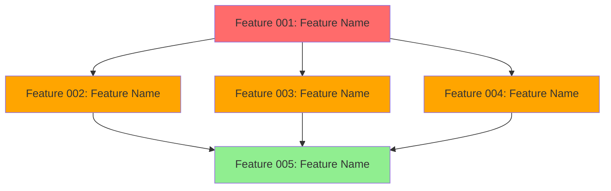
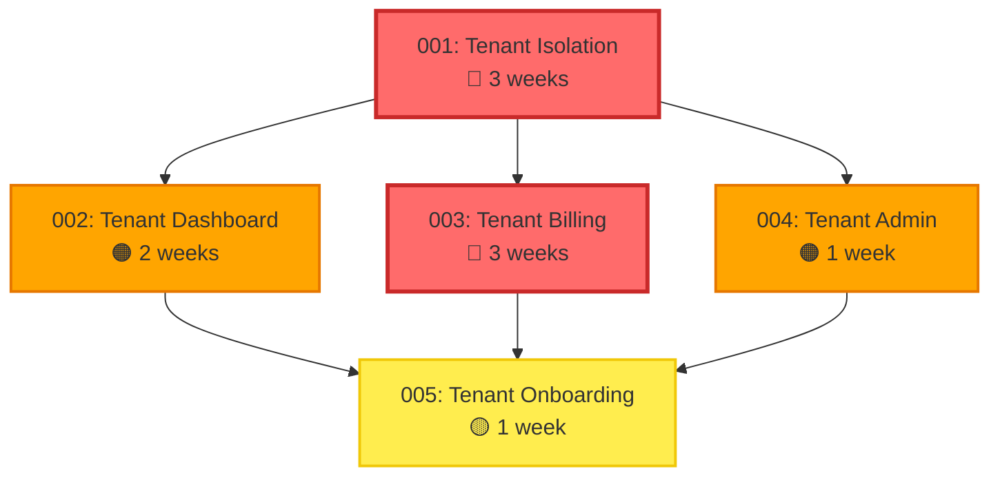

# Epic Dependency Map: [EPIC_NAME]

**Epic ID**: EPIC-[NUMBER]
**Version**: 1.0.0
**Last Updated**: [YYYY-MM-DD]

---

## Dependency Graph

**Legend**:
- 🔴 **Critical Risk** (fill: red)
- 🟠 **High Risk** (fill: orange)
- 🟡 **Medium Risk** (fill: yellow)
- 🟢 **Low Risk** (fill: green)
- **Arrow Direction**: Dependency (A → B means B depends on A)

---

**Example** (Multi-Tenant SaaS):

---

## Dependency Table

| Feature ID | Feature Name | Depends On | Blocks | Type | Rationale |
|------------|--------------|------------|--------|------|-----------|
| [###] | [Feature name] | [[###, ###]] | [[###, ###]] | [Hard/Soft/Optional] | [Why this dependency exists] |
| [###] | [Feature name] | [[###, ###]] | [[###, ###]] | [Hard/Soft/Optional] | [Why this dependency exists] |
| [###] | [Feature name] | [[###, ###]] | [[###, ###]] | [Hard/Soft/Optional] | [Why this dependency exists] |

**Dependency Types**:
- **Hard**: Feature CANNOT start until dependency complete (e.g., API contract, database schema)
- **Soft**: Feature CAN start but CANNOT finish until dependency complete (e.g., UI can start before API complete)
- **Optional**: Feature is enhanced by dependency but not blocked (e.g., analytics integration)

---

**Example**:

| Feature ID | Feature Name | Depends On | Blocks | Type | Rationale |
|------------|--------------|------------|--------|------|-----------|
| 001 | Tenant Isolation | [] | [002, 003, 004] | Hard | Foundation - tenant_id schema, RLS policies required for all features |
| 002 | Tenant Dashboard | [001] | [005] | Hard | Requires tenant context from 001, provides UI for onboarding flow in 005 |
| 003 | Tenant Billing | [001] | [005] | Hard | Requires tenant isolation, provides pricing for onboarding in 005 |
| 004 | Tenant Admin | [001] | [005] | Soft | Requires tenant context, admin features optional for onboarding |
| 005 | Tenant Onboarding | [002, 003, 004] | [] | Hard | Integrates dashboard, billing, admin into end-to-end flow |

---

## Critical Path Analysis

**Critical Path**: [###] → [###] → [###] → [###]

**Total Duration (Critical Path)**: [N] weeks

**Parallelization Opportunities**:
- **Wave 1**: [Feature ###] (Week [N])
- **Wave 2 (Parallel)**: [Features ###, ###, ###] (Week [N-M])
- **Wave 3**: [Feature ###] (Week [M])

**Bottleneck Features**: [Features that have the most dependencies]

---

**Example**:

**Critical Path**: 001 (Foundation) → 003 (Billing) → 005 (Onboarding)

**Total Duration (Critical Path)**: 7 weeks (3 + 3 + 1)

**Parallelization Opportunities**:
- **Wave 1**: Feature 001 (Week 1-3) - Foundation
- **Wave 2 (Parallel)**: Features 002, 003, 004 (Week 4-5) - Core Features (2 parallel teams)
- **Wave 3**: Feature 005 (Week 6) - Integration

**Bottleneck Features**:
- **001 (Tenant Isolation)**: Blocks all other features - highest priority
- **005 (Onboarding)**: Blocked by all other features - integrates everything

**Time Savings**: 10 weeks (sequential) → **6 weeks (parallelized)** = 40% reduction

---

## Risk Propagation Matrix

**Purpose**: How does delay/failure in one feature impact others?

| Feature | If Delayed by 1 Week | If Fails Completely | Mitigation |
|---------|----------------------|---------------------|------------|
| [###] | [Impact on downstream features] | [Impact on epic] | [Mitigation strategy] |
| [###] | [Impact on downstream features] | [Impact on epic] | [Mitigation strategy] |
| [###] | [Impact on downstream features] | [Impact on epic] | [Mitigation strategy] |

---

**Example**:

| Feature | If Delayed by 1 Week | If Fails Completely | Mitigation |
|---------|----------------------|---------------------|------------|
| 001 (Isolation) | Epic delayed 1 week (blocks all) | Epic cancelled (no multi-tenancy) | Pre-validate RLS approach with POC before feature start |
| 002 (Dashboard) | 005 delayed 1 week (soft dependency) | 005 uses minimal UI (degraded onboarding) | Feature flag - launch without dashboard, add later |
| 003 (Billing) | 005 delayed 1 week (hard dependency) | 005 manual pricing (degraded onboarding) | Use flat pricing initially, defer complex billing |
| 004 (Admin) | No impact (soft dependency on 005) | 005 uses basic admin (degraded experience) | Onboarding works without admin panel |
| 005 (Onboarding) | Launch delayed 1 week (final integration) | Manual onboarding process (workaround) | Document manual tenant creation process |

---

## Parallelization Strategy

### Team Assignment (If Multiple Teams Available)

| Team | Wave | Features | Duration | Dependencies |
|------|------|----------|----------|--------------|
| [Team name] | [Wave #] | [[###, ###]] | [N weeks] | [Prerequisites] |
| [Team name] | [Wave #] | [[###, ###]] | [N weeks] | [Prerequisites] |

---

**Example** (2 Teams):

| Team | Wave | Features | Duration | Dependencies |
|------|------|----------|----------|--------------|
| Team A | Wave 1 | [001] | 3 weeks | None - start immediately |
| Team B | Wave 1 | [Research] | 3 weeks | Research billing providers during Wave 1 |
| Team A | Wave 2 | [002, 004] | 2 weeks | Wait for 001 complete |
| Team B | Wave 2 | [003] | 3 weeks | Wait for 001 complete |
| Team A | Wave 3 | [005] | 1 week | Wait for 002, 003, 004 complete |

**Team Utilization**: 2 teams × 6 weeks = 12 team-weeks (vs 10 weeks sequential with 1 team)

---

### Single Team Sequencing

**Recommended Order** (If Only 1 Team):

1. **Week 1-3**: Feature [###] (Foundation)
2. **Week 4-5**: Feature [###] (Highest priority dependent)
3. **Week 6-7**: Feature [###] (Second priority)
4. **Week 8**: Features [###, ###] (Quick wins - can be parallelized within team)
5. **Week 9**: Feature [###] (Integration)

**Rationale**: Prioritize by (1) Critical path features, (2) Features that unblock others, (3) High-risk features early

---

**Example** (1 Team):

1. **Week 1-3**: Feature 001 (Tenant Isolation) - Unblocks everything
2. **Week 4-6**: Feature 003 (Tenant Billing) - On critical path, high risk
3. **Week 7-8**: Feature 002 (Tenant Dashboard) - Medium risk
4. **Week 9**: Feature 004 (Tenant Admin) - Quick win, low risk
5. **Week 10**: Feature 005 (Tenant Onboarding) - Integration

**Total Duration**: 10 weeks (vs 6 weeks with 2 teams)

---

## Integration Points & Handoffs

**Purpose**: Define what each feature must deliver for downstream features

| From Feature | To Feature | Integration Contract | Delivery Date | Status |
|--------------|------------|----------------------|---------------|--------|
| [###] | [###] | [What must be delivered] | [Week #] | [🟢/🟡/🔴] |
| [###] | [###] | [What must be delivered] | [Week #] | [🟢/🟡/🔴] |

---

**Example**:

| From Feature | To Feature | Integration Contract | Delivery Date | Status |
|--------------|------------|----------------------|---------------|--------|
| 001 (Isolation) | 002 (Dashboard) | `ITenantService` interface, `getTenantContext(req)` helper | End of Week 3 | 🟢 ON TRACK |
| 001 (Isolation) | 003 (Billing) | `tenant_id` column in all tables, RLS policies active | End of Week 3 | 🟢 ON TRACK |
| 001 (Isolation) | 004 (Admin) | Tenant CRUD operations, `resolveTenantBySubdomain()` | End of Week 3 | 🟢 ON TRACK |
| 002 (Dashboard) | 005 (Onboarding) | Tenant dashboard UI component, usage metrics endpoint | End of Week 5 | 🟡 AT RISK |
| 003 (Billing) | 005 (Onboarding) | Plan selection API, subscription creation endpoint | End of Week 6 | 🟢 ON TRACK |
| 004 (Admin) | 005 (Onboarding) | User invitation API, role assignment endpoint | End of Week 5 | 🟢 ON TRACK |

**Status Legend**:
- 🟢 **ON TRACK**: Feature progressing as planned
- 🟡 **AT RISK**: Potential delay (1-2 days)
- 🔴 **BLOCKED**: Delay confirmed (>3 days)

---

## Dependency Change Log

**Purpose**: Track changes to dependencies as epic evolves

| Date | Feature | Change | Reason | Impact |
|------|---------|--------|--------|--------|
| [YYYY-MM-DD] | [###] | [Dependency added/removed/changed] | [Why] | [How this affects timeline/other features] |

---

**Example**:

| Date | Feature | Change | Reason | Impact |
|------|---------|--------|--------|--------|
| 2025-01-20 | 004 (Admin) | Changed from Hard to Soft dependency on 005 | Admin panel optional for MVP onboarding flow | 005 can proceed if 004 delayed |
| 2025-01-25 | 003 (Billing) | Added 1-week buffer | Billing provider integration more complex than expected | Epic timeline extended Week 6 → Week 7 |
| 2025-02-01 | 002 (Dashboard) | Reduced scope - defer analytics widgets | Analytics not critical for onboarding | 002 duration reduced 2 weeks → 1 week |

---

## Assumptions & Constraints

### Assumptions
- [Assumption 1 about resources, timelines, dependencies]
- [Assumption 2 about resources, timelines, dependencies]

### Constraints
- [Constraint 1 that limits parallelization or sequencing]
- [Constraint 2 that limits parallelization or sequencing]

---

**Example**:

### Assumptions
- 2 full-stack engineers available for entire epic duration
- Database schema changes can be deployed independently (no downtime)
- External billing provider API (Stripe) available with 99.9% SLA

### Constraints
- Must deploy in production by end of Q1 2025 (hard deadline)
- Cannot hire additional engineers mid-epic (budget constraint)
- Feature 001 must be security-reviewed before ANY other feature starts (compliance requirement)
- All features must maintain backward compatibility with single-tenant mode for 6 months

---

## Validation Checklist

- [ ] All features have clearly defined dependencies
- [ ] No circular dependencies detected
- [ ] Critical path identified and optimized
- [ ] Parallelization opportunities maximized
- [ ] Risk propagation understood and mitigated
- [ ] Integration contracts defined for all handoffs
- [ ] Team assignments feasible (capacity, skills)
- [ ] Timeline accounts for testing, reviews, deployment
- [ ] Assumptions documented and validated with stakeholders
- [ ] Constraints acknowledged and accounted for

---

**Version History**:

| Version | Date | Changes | Author |
|---------|------|---------|--------|
| 1.0.0 | [YYYY-MM-DD] | Initial dependency map | [Name] |

---

**Dependency Map Status**: [Draft / In Review / Approved / Superseded]
**Approved By**: [Name/Role]
**Approved Date**: [YYYY-MM-DD]
